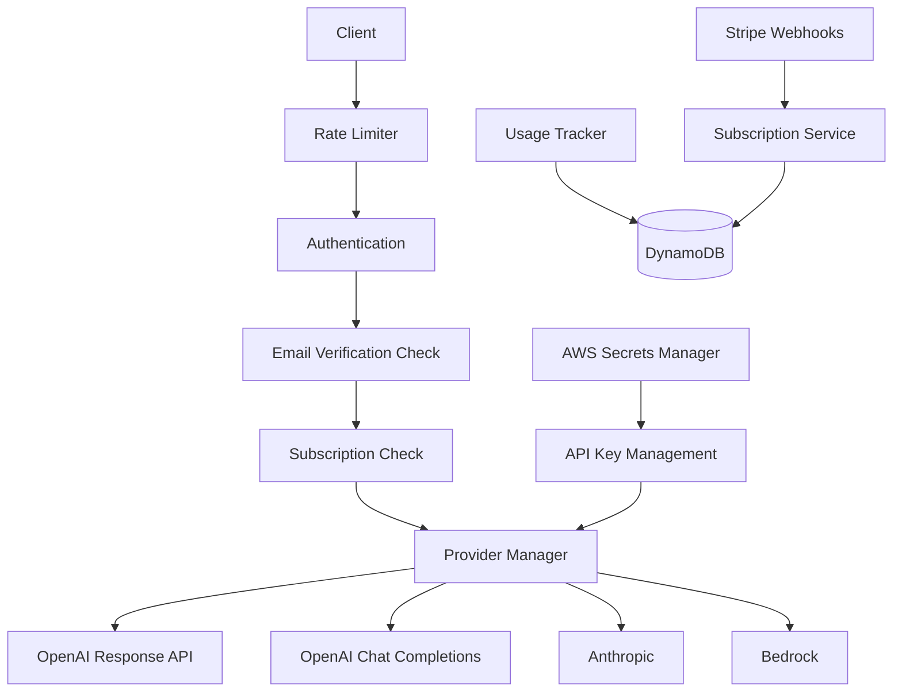

# LLM Proxy Service

A comprehensive proxy service for accessing multiple LLM providers (OpenAI, Anthropic, Bedrock) with advanced authentication, receipt parsing, and subscription management using DynamoDB.

## Features

- 🔐 **Multi-Auth Support:** JWT, Google OAuth, Apple Sign In
- 💳 **Multi-Platform Subscriptions:** Stripe (Web), iOS App Store, Android Play Store
- 🍎 **iOS Integration:** Full App Store receipt validation & server-to-server notifications
- 🌐 **LLM Provider Support:** OpenAI GPT-5, Anthropic, AWS Bedrock
- 📊 **Usage Tracking:** Request/token limits with detailed analytics
- 🛡️ **Security:** Rate limiting, input validation, secure headers
- ⚡ **Flexible API:** Query parameters and POST body support
- 📱 **Database:** DynamoDB with comprehensive subscription models
- 🧾 **Receipt Parsing:** GPT-5 Vision API for store receipt analysis
- 🎯 **Email Verification:** Optional email verification with configurable settings

## Quick Start

1. **Install dependencies:**
```bash
npm install
```

2. **Setup AWS DynamoDB:**
```bash
# Configure AWS CLI or set environment variables
aws configure

# Create DynamoDB tables (optional - auto-created in production)
npm run setup-dynamodb
```

3. **Configure environment:**
```bash
cp .env.example .env
# Edit .env with your credentials
```

4. **Start the service:**
```bash
npm start
# or for development
npm run dev
```

## 🔐 Authentication Methods

### 1. Email/Password Registration

```bash
curl -X POST http://localhost:3000/auth/register \
  -H "Content-Type: application/json" \
  -d '{
    "email": "user@example.com",
    "username": "testuser",
    "password": "password123"
  }'
```

```bash
curl -X POST http://localhost:3000/auth/login \
  -H "Content-Type: application/json" \
  -d '{
    "email": "user@example.com",
    "password": "password123"
  }'
```

### 2. Google OAuth
```
GET /auth/google
GET /auth/google/callback
```

### 3. Apple Sign In  
```
GET /auth/apple
POST /auth/apple/callback
```

## 🧾 Receipt Parsing API

The service includes a powerful receipt parsing feature using GPT-5 Vision API:

```bash
curl -X POST http://localhost:3000/api/parse-receipt \
  -H "Authorization: Bearer YOUR_JWT_TOKEN" \
  -F "receipt=@/path/to/receipt.jpg" \
  -F "model=gpt-5-turbo" \
  -F "prompt=Extract all items, prices, and total from this receipt"
```

**Supported Image Formats:** JPG, PNG, GIF, WEBP  
**Max File Size:** 10MB  
**Models:** GPT-5-turbo (Response API), GPT-4o (Chat Completions fallback)

## 💳 Subscription Plans

| Plan | Price | Requests/Month | Tokens/Month | Features |
|------|-------|----------------|--------------|----------|
| **Free** | $0 | 100 | 10,000 | Basic access, Community support |
| **Pro** | $29.99 | 1,000 | 100,000 | Priority support, Advanced models |
| **Enterprise** | $99.99 | Unlimited | Unlimited | Dedicated support, Custom models, SLA |

### Subscription Management
```bash
# Get available plans
curl "http://localhost:3000/subscription/plans"

# Check subscription status
curl "http://localhost:3000/subscription/status" \
  -H "Authorization: Bearer YOUR_JWT_TOKEN"

# Create subscription
curl -X POST "http://localhost:3000/subscription/create" \
  -H "Authorization: Bearer YOUR_JWT_TOKEN" \
  -H "Content-Type: application/json" \
  -d '{"plan": "pro"}'

# Get usage statistics
curl "http://localhost:3000/subscription/usage" \
  -H "Authorization: Bearer YOUR_JWT_TOKEN"
```

## 🚀 API Usage

### Query Parameter Format:
```bash
curl "http://localhost:3000/api?provider=openai&model=o1-preview&prompt=hello" \
  -H "Authorization: Bearer YOUR_JWT_TOKEN"
```

### POST Request Format:
```bash
curl -X POST http://localhost:3000/api/completion \
  -H "Authorization: Bearer YOUR_JWT_TOKEN" \
  -H "Content-Type: application/json" \
  -d '{
    "provider": "openai",
    "model": "gpt-4o",
    "prompt": "Hello, how are you?",
    "max_tokens": 100,
    "temperature": 0.7
  }'
```

### Supported Providers and Models

#### OpenAI (with Response API and Chat Completions support)
- **GPT-5:** gpt-5-turbo (Response API)
- **GPT-4:** gpt-4o, gpt-4-turbo, gpt-4 (Chat Completions API)
- **GPT-3.5:** gpt-3.5-turbo
- **Reasoning Models:** o1-preview, o1-mini, o3-mini

#### Anthropic
- claude-3-5-sonnet-20241022, claude-3-5-haiku-20241022, claude-3-opus-20240229

#### Bedrock
- anthropic.claude-3-5-sonnet-20241022-v2:0, amazon.titan-text-premier-v1:0

## 📱 Web Interface

The service includes a clean web interface accessible at the root URL:

- **Login/Register:** Pre-filled test credentials for quick testing
- **Receipt Parser:** Upload and analyze receipt images with GPT-5
- **Model Selection:** Choose between GPT-5-turbo and GPT-4o
- **Real-time Results:** View parsed receipt data with structured output

Test credentials (pre-configured):
- Email: `testreceipt@finbrightai.com`
- Password: `testpass123`

## 🔄 Service Architecture & Flow



### Request Processing Flow:
1. **Rate Limiting:** Check IP-based limits
2. **Authentication:** Validate JWT token
3. **Email Verification:** Optional check based on configuration
4. **Subscription Validation:** Check plan limits & usage
5. **Provider Routing:** Route to appropriate LLM provider with secure API key retrieval
6. **Usage Tracking:** Log requests/tokens to DynamoDB for billing
7. **Response:** Return LLM response with usage data

## 🛡️ Security Features

- **Multi-layer Authentication:** JWT + OAuth + Rate limiting
- **Secure API Key Storage:** AWS Secrets Manager integration
- **Subscription Enforcement:** Plan-based access control
- **Usage Monitoring:** Real-time tracking and limits
- **Secure Headers:** Helmet.js protection with CSP
- **Input Validation:** Joi schema validation
- **Request Logging:** Comprehensive audit trail
- **Email Verification:** Optional email verification system

## 📊 Monitoring & Analytics

- **Usage Tracking:** Requests, tokens, costs by provider/model stored in DynamoDB
- **Plan Enforcement:** Automatic limit checking with monthly reset
- **Billing Integration:** Stripe webhook handling
- **Error Logging:** Winston-based structured logging
- **Health Checks:** Service status monitoring with database connectivity

## Environment Variables

| Category | Variable | Description | Required |
|----------|----------|-------------|----------|
| **Server** | PORT | Server port | No (3000) |
| | NODE_ENV | Environment | No (development) |
| **Database** | AWS_REGION | DynamoDB region | Yes |
| | DYNAMODB_USERS_TABLE | Users table name | No |
| | DYNAMODB_SESSIONS_TABLE | Sessions table name | No |
| | DYNAMODB_USAGE_TABLE | Usage table name | No |
| | DYNAMODB_LOCAL_ENDPOINT | Local DynamoDB endpoint | No |
| **Auth** | JWT_SECRET | JWT signing key | Yes |
| | SESSION_SECRET | Session secret | Yes |
| | SESSION_TIMEOUT_HOURS | Session timeout | No (5) |
| **Email** | REQUIRE_EMAIL_VERIFICATION | Require email verification | No (false) |
| | EMAIL_SERVICE_ENABLED | Enable email service | No (false) |
| **Google OAuth** | GOOGLE_CLIENT_ID | OAuth client ID | No |
| | GOOGLE_CLIENT_SECRET | OAuth secret | No |
| **Apple OAuth** | APPLE_CLIENT_ID | Apple client ID | No |
| | APPLE_TEAM_ID | Apple team ID | No |
| | APPLE_KEY_ID | Apple key ID | No |
| | APPLE_PRIVATE_KEY | Apple private key | No |
| **LLM APIs** | OPENAI_API_KEY | OpenAI key or use Secrets Manager | No |
| | ANTHROPIC_API_KEY | Anthropic key | No |
| | AWS_ACCESS_KEY_ID | AWS access key | No |
| | AWS_SECRET_ACCESS_KEY | AWS secret key | No |
| **Stripe** | STRIPE_SECRET_KEY | Stripe API key | No |
| | STRIPE_WEBHOOK_SECRET | Webhook secret | No |
| **Rate Limiting** | RATE_LIMIT_WINDOW_MS | Rate limit window | No (900000) |
| | RATE_LIMIT_MAX_REQUESTS | Max requests per window | No (100) |

## 🚀 Production Deployment

### AWS App Runner Configuration

The service is optimized for AWS App Runner deployment:

1. **Auto-scaling:** Based on request volume
2. **DynamoDB Integration:** Automatic table creation and management
3. **Secrets Management:** API keys stored securely in AWS Secrets Manager
4. **Health Checks:** Built-in health monitoring endpoint
5. **Environment Variables:** Configured via App Runner environment settings

### Deployment Steps:

1. Configure AWS App Runner with your repository
2. Set environment variables (JWT_SECRET, AWS_REGION, etc.)
3. Configure API keys in AWS Secrets Manager:
   - Secret Name: `llm-proxy-openai-api-key`
   - Secret Value: Your OpenAI API key
4. Deploy and monitor via AWS Console

## 📝 Logging and Debugging

The service uses structured logging with different log levels:

- **INFO:** Service startup, successful operations
- **WARN:** Rate limiting, failed authentication attempts
- **ERROR:** Database errors, API failures, critical issues
- **DEBUG:** Detailed request/response information

Log format includes timestamps, service identification, and contextual metadata for easy monitoring and debugging.

## 🧪 Testing

Test user is automatically created for development:
- Email: `testreceipt@finbrightai.com`
- Password: `testpass123`
- Plan: Free (100 requests, 10,000 tokens per month)

## 📞 Support

For issues and feature requests, please check the service logs and ensure all required environment variables are properly configured. The service includes comprehensive error handling and logging to help diagnose issues.

## Architecture Benefits

- **Serverless-Ready:** DynamoDB provides automatic scaling and management
- **Cost-Effective:** Pay-per-use pricing model
- **Secure:** Built-in encryption and access control
- **Global:** Multi-region support and low latency
- **Reliable:** 99.999% availability SLA from AWS
- **Flexible:** Support for various authentication methods and subscription models