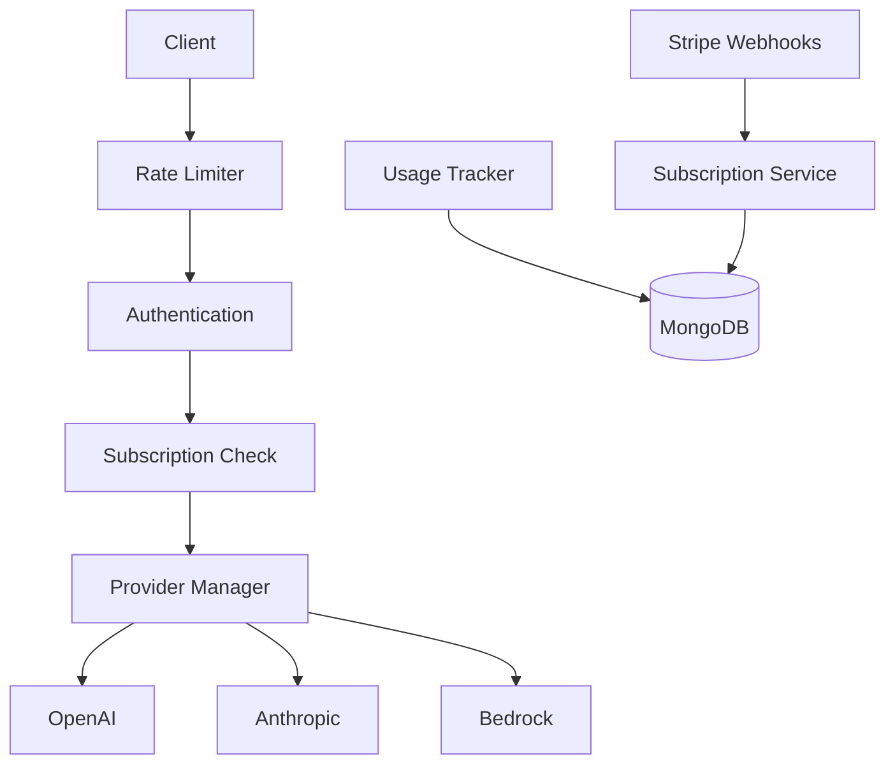

# LLM Proxy Service

A comprehensive proxy service for accessing multiple LLM providers (OpenAI, Anthropic, Bedrock) with advanced authentication, social login, and subscription management.

## Features

- 🔐 **Multi-Auth Support:** JWT, Google OAuth, Apple Sign In
- 💳 **Multi-Platform Subscriptions:** Stripe (Web), iOS App Store, Android Play Store
- 🍎 **iOS Integration:** Full App Store receipt validation & server-to-server notifications
- 🌐 **LLM Provider Support:** OpenAI, Anthropic, AWS Bedrock
- 📊 **Usage Tracking:** Request/token limits with detailed analytics
- 🛡️ **Security:** Rate limiting, input validation, secure headers
- ⚡ **Flexible API:** Query parameters and POST body support
- 📱 **Database:** MongoDB with comprehensive subscription models

## Quick Start

1. **Install dependencies:**
```bash
npm install
```

2. **Setup MongoDB:**
```bash
# Start MongoDB locally or use MongoDB Atlas
mongod
```

3. **Configure environment:**
```bash
cp .env.example .env
# Edit .env with your credentials
```

4. **Start the service:**
```bash
npm start
# or for development
npm run dev
```

## 🔐 Authentication Methods

### 1. Email/Password Registration

```bash
curl -X POST http://localhost:3000/auth/register \
  -H "Content-Type: application/json" \
  -d '{
    "email": "user@example.com",
    "username": "testuser",
    "password": "password123"
  }'
```

```bash
curl -X POST http://localhost:3000/auth/login \
  -H "Content-Type: application/json" \
  -d '{
    "email": "user@example.com",
    "password": "password123"
  }'
```

### 2. Google OAuth
```
GET /auth/google
GET /auth/google/callback
```

### 3. Apple Sign In  
```
GET /auth/apple
POST /auth/apple/callback
```

## 💳 Subscription Plans

| Plan | Price | Requests/Month | Tokens/Month | Features |
|------|-------|----------------|--------------|----------|
| **Free** | $0 | 100 | 10,000 | Basic access, Community support |
| **Pro** | $29.99 | 1,000 | 100,000 | Priority support, Advanced models |
| **Enterprise** | $99.99 | Unlimited | Unlimited | Dedicated support, Custom models, SLA |

### Subscription Management
```bash
# Get available plans
curl "http://localhost:3000/subscription/plans"

# Check subscription status
curl "http://localhost:3000/subscription/status" \
  -H "Authorization: Bearer YOUR_JWT_TOKEN"

# Create subscription
curl -X POST "http://localhost:3000/subscription/create" \
  -H "Authorization: Bearer YOUR_JWT_TOKEN" \
  -H "Content-Type: application/json" \
  -d '{"plan": "pro"}'

# Get usage statistics
curl "http://localhost:3000/subscription/usage" \
  -H "Authorization: Bearer YOUR_JWT_TOKEN"
```

## 🚀 API Usage

### Query Parameter Format (as requested):
```bash
curl "http://localhost:3000/api?provider=openai&model=o3&prompt=hello" \
  -H "Authorization: Bearer YOUR_JWT_TOKEN"
```

### POST Request Format:
```bash
curl -X POST http://localhost:3000/api/completion \
  -H "Authorization: Bearer YOUR_JWT_TOKEN" \
  -H "Content-Type: application/json" \
  -d '{
    "provider": "openai",
    "model": "gpt-4",
    "prompt": "Hello, how are you?",
    "max_tokens": 100,
    "temperature": 0.7
  }'
```

### Supported Providers and Models

#### OpenAI
- gpt-4, gpt-4-turbo, gpt-3.5-turbo, o1-preview, o1-mini, o3-mini

#### Anthropic
- claude-3-5-sonnet-20241022, claude-3-5-haiku-20241022, claude-3-opus-20240229

#### Bedrock
- anthropic.claude-3-5-sonnet-20241022-v2:0, amazon.titan-text-premier-v1:0

### Get Available Models:
```bash
curl "http://localhost:3000/api/models" \
  -H "Authorization: Bearer YOUR_JWT_TOKEN"
```

### Get Available Providers:
```bash
curl "http://localhost:3000/api/providers" \
  -H "Authorization: Bearer YOUR_JWT_TOKEN"
```

## 🔄 Service Architecture & Flow



### Request Processing Flow:
1. **Rate Limiting:** Check IP-based limits
2. **Authentication:** Validate JWT token
3. **Subscription Validation:** Check plan limits & usage
4. **Provider Routing:** Route to appropriate LLM provider
5. **Usage Tracking:** Log requests/tokens for billing
6. **Response:** Return LLM response with usage data

## 🛡️ Security Features

- **Multi-layer Authentication:** JWT + OAuth + Rate limiting
- **Subscription Enforcement:** Plan-based access control
- **Usage Monitoring:** Real-time tracking and limits
- **Secure Headers:** Helmet.js protection
- **Input Validation:** Joi schema validation
- **Request Logging:** Comprehensive audit trail

## 📊 Monitoring & Analytics

- **Usage Tracking:** Requests, tokens, costs by provider/model
- **Plan Enforcement:** Automatic limit checking
- **Billing Integration:** Stripe webhook handling
- **Error Logging:** Winston-based structured logging
- **Health Checks:** Service status monitoring

## Environment Variables

| Category | Variable | Description | Required |
|----------|----------|-------------|----------|
| **Server** | PORT | Server port | No (3000) |
| | NODE_ENV | Environment | No (development) |
| | MONGODB_URI | Database connection | Yes |
| **Auth** | JWT_SECRET | JWT signing key | Yes |
| | SESSION_SECRET | Session secret | Yes |
| **Google OAuth** | GOOGLE_CLIENT_ID | OAuth client ID | No |
| | GOOGLE_CLIENT_SECRET | OAuth secret | No |
| **Apple OAuth** | APPLE_CLIENT_ID | Apple client ID | No |
| | APPLE_TEAM_ID | Apple team ID | No |
| | APPLE_KEY_ID | Apple key ID | No |
| | APPLE_PRIVATE_KEY | Apple private key | No |
| **LLM APIs** | OPENAI_API_KEY | OpenAI key | No |
| | ANTHROPIC_API_KEY | Anthropic key | No |
| | AWS_ACCESS_KEY_ID | AWS access key | No |
| | AWS_SECRET_ACCESS_KEY | AWS secret key | No |
| **Stripe** | STRIPE_SECRET_KEY | Stripe API key | No |
| | STRIPE_WEBHOOK_SECRET | Webhook secret | No |