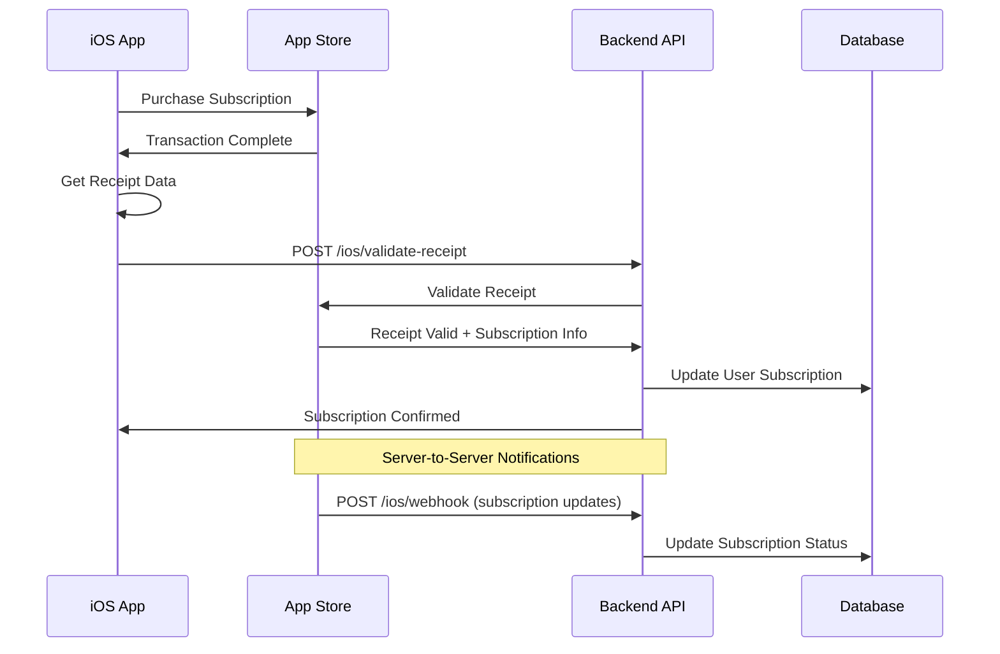

# iOS App Store Subscription Integration Guide

This guide covers how to integrate your iOS app with the LLM Proxy Service backend for subscription management.

## Overview

The backend supports iOS App Store subscriptions through:
- **Receipt Validation**: Server-side validation of App Store receipts
- **Real-time Updates**: App Store Server-to-Server notifications
- **Subscription Management**: Automatic plan enforcement based on iOS purchases
- **Restore Purchases**: Handle subscription restoration

## Backend Configuration

### 1. App Store Connect Setup

1. **Create In-App Purchases** in App Store Connect:
   ```
   Product IDs (configure in .env):
   - com.yourapp.pro.monthly (Pro Monthly)
   - com.yourapp.pro.yearly (Pro Yearly) 
   - com.yourapp.enterprise.monthly (Enterprise Monthly)
   - com.yourapp.enterprise.yearly (Enterprise Yearly)
   ```

2. **Get Shared Secret**:
   - Go to App Store Connect → Your App → App Information
   - Generate Master Shared Secret
   - Add to `.env` as `IOS_SHARED_SECRET`

3. **Configure Server-to-Server Notifications**:
   ```
   Webhook URL: https://yourapi.com/ios/webhook
   ```

### 2. Environment Variables

```env
# iOS App Store Configuration
IOS_SHARED_SECRET=your-app-store-connect-shared-secret
IOS_PRO_MONTHLY_PRODUCT_ID=com.yourapp.pro.monthly
IOS_PRO_YEARLY_PRODUCT_ID=com.yourapp.pro.yearly
IOS_ENTERPRISE_MONTHLY_PRODUCT_ID=com.yourapp.enterprise.monthly
IOS_ENTERPRISE_YEARLY_PRODUCT_ID=com.yourapp.enterprise.yearly
```

## API Endpoints

### 1. Validate Receipt
**POST** `/ios/validate-receipt`

Validates an App Store receipt and updates user subscription.

```bash
curl -X POST https://yourapi.com/ios/validate-receipt \
  -H "Authorization: Bearer JWT_TOKEN" \
  -H "Content-Type: application/json" \
  -d '{
    "receiptData": "base64-encoded-receipt-data"
  }'
```

**Response:**
```json
{
  "success": true,
  "message": "Receipt validated successfully",
  "data": {
    "subscription": {
      "plan": "pro",
      "status": "active",
      "expiresDate": "2024-12-01T00:00:00.000Z",
      "productId": "com.yourapp.pro.monthly",
      "transactionId": "1000000123456789"
    },
    "user": {
      "id": "user_id",
      "subscription": { ... }
    }
  }
}
```

### 2. Get Subscription Status
**GET** `/ios/status`

Gets current iOS subscription status for authenticated user.

```bash
curl https://yourapi.com/ios/status \
  -H "Authorization: Bearer JWT_TOKEN"
```

**Response:**
```json
{
  "success": true,
  "data": {
    "plan": "pro",
    "status": "active",
    "platform": "ios",
    "expiresDate": "2024-12-01T00:00:00.000Z",
    "usage": {
      "requests": { "current": 45, "limit": 1000, "percentage": 4.5 },
      "tokens": { "current": 12500, "limit": 100000, "percentage": 12.5 }
    },
    "ios": {
      "productId": "com.yourapp.pro.monthly",
      "transactionId": "1000000123456789",
      "lastValidationDate": "2024-01-15T10:30:00.000Z",
      "needsReceiptRefresh": false
    }
  }
}
```

### 3. Restore Purchases
**POST** `/ios/restore`

Restores previous purchases from App Store receipt.

```bash
curl -X POST https://yourapi.com/ios/restore \
  -H "Authorization: Bearer JWT_TOKEN" \
  -H "Content-Type: application/json" \
  -d '{
    "receiptData": "base64-encoded-receipt-data"
  }'
```

### 4. Get iOS Plans
**GET** `/ios/plans`

Gets available subscription plans with iOS product IDs.

```bash
curl https://yourapi.com/ios/plans
```

## iOS App Implementation

### 1. StoreKit Setup

```swift
import StoreKit

class SubscriptionManager: NSObject, ObservableObject {
    @Published var subscriptionStatus: String = "free"
    
    override init() {
        super.init()
        SKPaymentQueue.default().add(self)
    }
    
    func purchaseSubscription(productId: String) {
        // Implement StoreKit purchase flow
        guard let product = products.first(where: { $0.productIdentifier == productId }) else { return }
        
        let payment = SKPayment(product: product)
        SKPaymentQueue.default().add(payment)
    }
}

extension SubscriptionManager: SKPaymentTransactionObserver {
    func paymentQueue(_ queue: SKPaymentQueue, updatedTransactions transactions: [SKPaymentTransaction]) {
        for transaction in transactions {
            switch transaction.transactionState {
            case .purchased, .restored:
                // Validate receipt with backend
                validateReceiptWithBackend()
                queue.finishTransaction(transaction)
            case .failed:
                queue.finishTransaction(transaction)
            default:
                break
            }
        }
    }
}
```

### 2. Receipt Validation

```swift
func validateReceiptWithBackend() {
    guard let receiptURL = Bundle.main.appStoreReceiptURL,
          let receiptData = try? Data(contentsOf: receiptURL) else {
        return
    }
    
    let base64Receipt = receiptData.base64EncodedString()
    
    let request = URLRequest(url: URL(string: "https://yourapi.com/ios/validate-receipt")!)
    request.setValue("Bearer \(authToken)", forHTTPHeaderField: "Authorization")
    request.setValue("application/json", forHTTPHeaderField: "Content-Type")
    request.httpMethod = "POST"
    request.httpBody = try? JSONSerialization.data(withJSONObject: [
        "receiptData": base64Receipt
    ])
    
    URLSession.shared.dataTask(with: request) { data, response, error in
        // Handle response and update UI
        if let data = data {
            let result = try? JSONDecoder().decode(SubscriptionResponse.self, from: data)
            DispatchQueue.main.async {
                self.subscriptionStatus = result?.data.subscription.plan ?? "free"
            }
        }
    }.resume()
}
```

### 3. Subscription Status Checking

```swift
func checkSubscriptionStatus() {
    let request = URLRequest(url: URL(string: "https://yourapi.com/ios/status")!)
    request.setValue("Bearer \(authToken)", forHTTPHeaderField: "Authorization")
    
    URLSession.shared.dataTask(with: request) { data, response, error in
        if let data = data {
            let result = try? JSONDecoder().decode(SubscriptionStatusResponse.self, from: data)
            DispatchQueue.main.async {
                if result?.data.ios?.needsReceiptRefresh == true {
                    self.validateReceiptWithBackend() // Refresh if needed
                }
            }
        }
    }.resume()
}
```

## Flow Diagram



## Testing

### 1. Sandbox Testing
- Use sandbox Apple ID for testing
- Set `NODE_ENV=development` to use sandbox environment
- Test purchase, restore, and expiration flows

### 2. Production Setup
- Set `NODE_ENV=production` for production App Store validation
- Configure webhook URL in App Store Connect
- Monitor logs for receipt validation issues

## Subscription Plan Mapping

| iOS Product ID | Backend Plan | Requests/Month | Tokens/Month |
|---------------|--------------|----------------|--------------|
| com.yourapp.pro.monthly | pro | 1,000 | 100,000 |
| com.yourapp.pro.yearly | pro | 1,000 | 100,000 |
| com.yourapp.enterprise.monthly | enterprise | Unlimited | Unlimited |
| com.yourapp.enterprise.yearly | enterprise | Unlimited | Unlimited |

## Error Handling

Common error scenarios and handling:

1. **Invalid Receipt**: Return 400 with clear error message
2. **Expired Subscription**: Set user to free plan automatically  
3. **Network Issues**: Implement retry logic in iOS app
4. **Webhook Failures**: Backend logs errors for manual review

## Security Considerations

- Receipt validation happens server-side only
- Shared secret stored securely in environment variables
- All API calls require JWT authentication
- Webhook endpoint validates App Store signatures (if available)

This integration provides seamless iOS subscription management with automatic backend synchronization and plan enforcement.